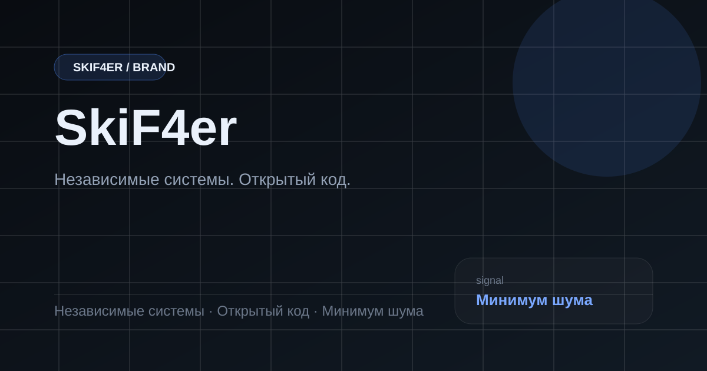

# SkiF4er

> Независимые системы. Открытый код.
>
> Минимум шума. Максимум контроля.

Эта документация — рабочий слой бренда и экосистемы SkiF4er.
Здесь собраны позиционирование, правила единого визуального контура, тексты для площадок и краткие описания ключевых систем.

## Что внутри

- бренд-система и тон общения
- визуальные токены и ассеты
- инструкции для GitBook, Telegram и Discord
- обзор продуктовой экосистемы
- короткие карточки систем

## Быстрые переходы

- [Бренд-система](identity/README.md)
- [Каналы и комьюнити](identity/community.md)
- [Настройка GitBook](identity/gitbook-setup.md)
- [Системы](systems/README.md)

## Главное правило

Публичный слой должен быть узнаваемым, спокойным и инженерно честным.
Сайт, GitBook, README и сообщества должны передавать один и тот же сигнал: **независимость, открытый код, дисциплина**.
