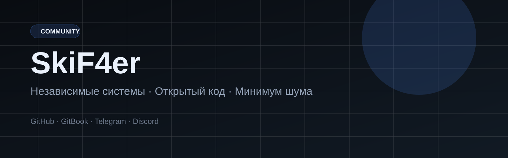

# Бренд-система SkiF4er

> Единый стиль для сайта, GitBook, README, Telegram и Discord.

## Основа бренда

- **Имя:** SkiF4er
- **Сигнал:** Независимые системы. Открытый код.
- **Второй слой:** Минимум шума. Максимум контроля.
- **Позиция:** open-source activist, senior full-stack developer, team leader
- **Интонация:** спокойная, прямая, инженерная, без крикливого маркетинга

## Что должно совпадать на всех площадках

1. Тёмная холодная палитра с одним сигнальным синим акцентом.
2. Короткие формулировки, сильные заголовки и минимум декоративного шума.
3. Один и тот же набор смыслов: независимость, открытый код, контроль, долгий горизонт.
4. Один и тот же порядок каналов: GitHub → GitBook → Telegram → Discord.

## Ассеты

- `assets/skif4er-cover.svg` — hero-обложка для README и GitBook
- `assets/skif4er-community-banner.svg` — широкая обложка для сообществ
- `assets/skif4er-avatar.svg` — квадратный знак для аватара
- `assets/skif4er-mark-dark.svg` / `assets/skif4er-mark-light.svg` — логотипы для тёмного и светлого режима GitBook

## Дальше

- [Позиционирование и тон](positioning.md)
- [Каналы и комьюнити](community.md)
- [Настройка GitBook](gitbook-setup.md)
